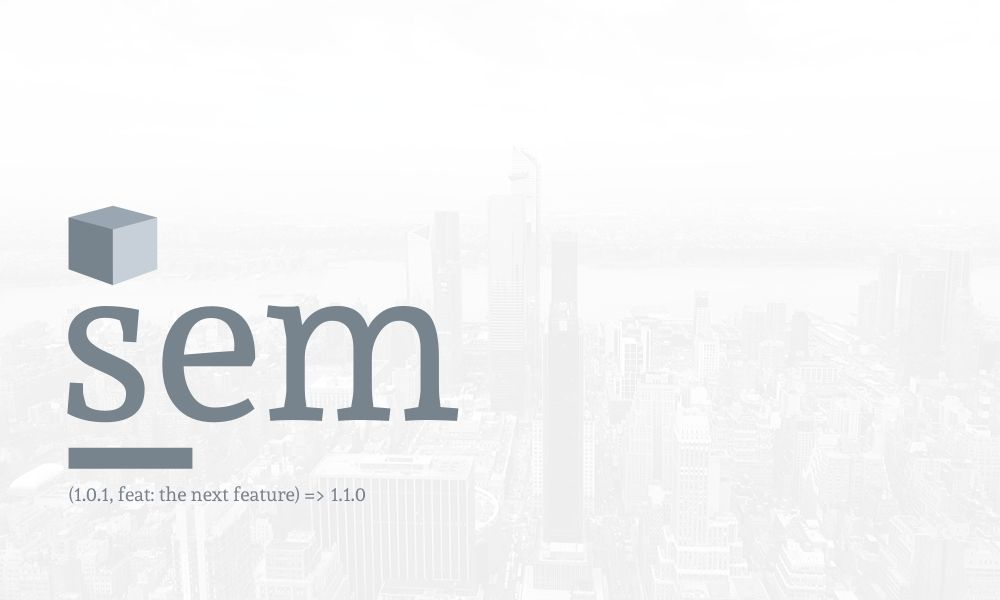

# Semantic Publishing

> A basic cli that works out your next semantic release from the last commit.



[](https://github.com/prettier/prettier)

---

## Contents

-   [Getting started](#getting-started)
-   [The process](#the-process)
-   [Usage](#usage)
-   [Resources](#resources)

## Get started

```
npm install sem
```

## Usage

### CLI

```sh
sempublish --bucket <bucketName>
```

### Modules

```js
const sempublish = require("sempublish")

;(async () => {
    await sempublish({
        bucket: "<bucket>",
    })
})()
```

## Commit Flags

Semver: `major.minor.patch` eg. `1.4.5`

| Flag     | Description                                                                                            | Semver |
| -------- | ------------------------------------------------------------------------------------------------------ | ------ |
| feat     | A new feature                                                                                          | Minor  |
| fix      | A bug fix                                                                                              | patch  |
| docs     | Documentation only changes                                                                             | patch  |
| style    | Changes that do not affect the meaning of the code (white-space, formatting, missing semi-colons, etc) | -      |
| refactor | A code change that neither fixes a bug nor adds a feature                                              | patch  |
| perf     | A code change that improves performance                                                                | patch  |
| test     | Adding missing or correcting existing tests                                                            | patch  |
| chore    | Changes to the build process or auxiliary tools and libraries such as documentation generation         | patch  |

## Testing

### Requirements

-   Setup us-east-1 ssh for Codecommit

```sh
ssh git-codecommit.us-east-1.amazonaws.com
```

## Resources

-   [How to automate your releases, versioning & release notes like a boss](https://medium.com/faun/automate-your-releases-versioning-and-release-notes-with-semantic-release-d5575b73d986)
-   [The case for pull rebase](https://megakemp.com/2019/03/20/the-case-for-pull-rebase/)
-   [Codebuild Git metadata](https://itnext.io/how-to-access-git-metadata-in-codebuild-when-using-codepipeline-codecommit-ceacf2c5c1dc?)
-   [When pipeline lacks git history](https://stackoverflow.com/questions/47310000/aws-codepipeline-build-lacks-git-history)
