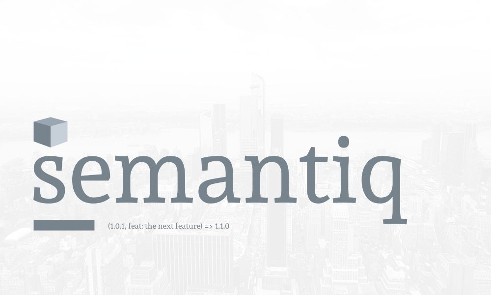

# Semantiq

> A most basic cli that gets the next semantic release, looking at the last commit and package.json version.



[](https://github.com/prettier/prettier)
[](https://travis-ci.com/gemmadlou/semantiq)
[](https://codecov.io/gh/gemmadlou/semantiq)


---

## Contents

-   [Usage](#getting-started)
-   [Commit Flags](#commit-flags-🏁)
-   [Resources](#resources)

## Usage

### Install

```sh
npm install semantiq
```

### CLI

```sh
semantiq
```

Expected output is the next release if the last commit follows the [Angular commits convention](https://github.com/angular/angular.js/blob/master/DEVELOPERS.md#-git-commit-guidelines) and a package.json exists.

### Example

Given you have a commit of:

```sh
feat: My brand new feature!
```

And a package with:

```json
{
    "version": "1.0.1"
}
```

When you call `semantiq`, the result will be:

```sh
$ 1.1.0
```

## Commit Flags 🏁

Semver: `major.minor.patch` eg. `1.4.5`

| Flag     | Description                                                                                            | Semver |
| -------- | ------------------------------------------------------------------------------------------------------ | ------ |
| feat     | A new feature                                                                                          | Minor  |
| fix      | A bug fix                                                                                              | patch  |
| docs     | Documentation only changes                                                                             | patch  |
| style    | Changes that do not affect the meaning of the code (white-space, formatting, missing semi-colons, etc) | -      |
| refactor | A code change that neither fixes a bug nor adds a feature                                              | patch  |
| perf     | A code change that improves performance                                                                | patch  |
| test     | Adding missing or correcting existing tests                                                            | patch  |
| chore    | Changes to the build process or auxiliary tools and libraries such as documentation generation         | patch  |

### No Major release

My current thinking is that major releases shouldn't be automated. If you think it should, create an issue.

## What it doesn't do

-   Create artefacts
-   Push or pull branches
-   Updates your package.json
-   Use any other semantic versioning

## Testing

```sh
npm test
```

## Next steps

-   Generate a change log? ([read](https://gist.github.com/stephenparish/9941e89d80e2bc58a153#generating-changelogmd))
-   Create an artefact? ([read](https://gist.github.com/gemmadlou/714a45f46d137cc503a52f4acb0f5b5e))

## Alternative tools

-   [Unleash](http://netflix.github.io/unleash/) - a fully fledged publishing system for GitHub and npm
-   [Semantic release](https://github.com/semantic-release/semantic-release) - Another automated publisher

## Thank yous

-   [Eric Elliot](https://medium.com/@_ericelliott) - Still not using his good functional programming principles but his lessons on modularity are awesome
-   [Jest](https://www.npmjs.com/package/jest) - Especially code coverage.
-   [Typescript](https://www.typescriptlang.org/docs/handbook/type-checking-javascript-files.html) - It's not a Typescript project but the `--checkJs` option catches lots of code correctness issues when using docblock comments.
-   [Husky](https://www.npmjs.com/package/husky) - Preventing me from committing errors
-   [ESLint](https://eslint.org/) - Keeps my code tidy
-   [Prettier](https://prettier.io/) - Prevents me from having to worry about style issues.

## Resources

-   [How to automate your releases, versioning & release notes like a boss](https://medium.com/faun/automate-your-releases-versioning-and-release-notes-with-semantic-release-d5575b73d986)
-   [The case for pull rebase](https://megakemp.com/2019/03/20/the-case-for-pull-rebase/)
-   [Codebuild Git metadata](https://itnext.io/how-to-access-git-metadata-in-codebuild-when-using-codepipeline-codecommit-ceacf2c5c1dc?)
-   [When pipeline lacks git history](https://stackoverflow.com/questions/47310000/aws-codepipeline-build-lacks-git-history)
